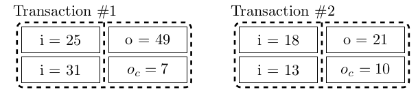
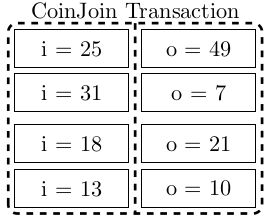
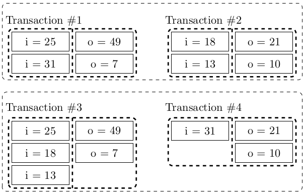
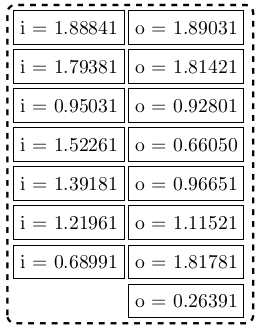
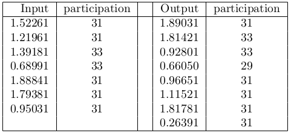
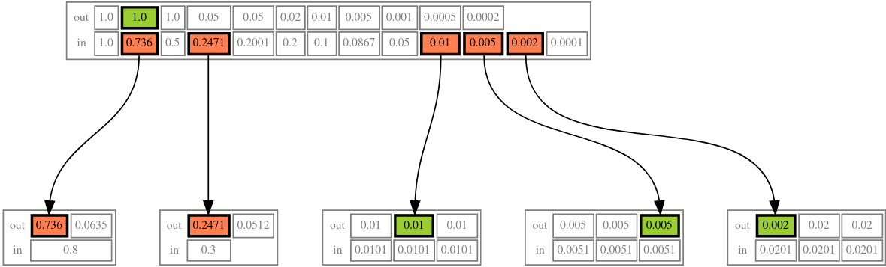
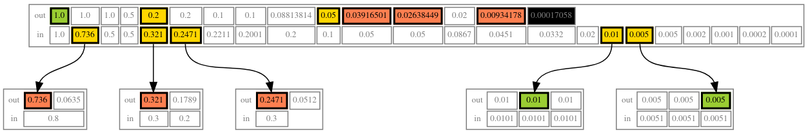

<!-- size: 19:6 -->

##### <!--fit--> Wasabi Wallet 

*El desafío de la privacidad: adopción y la escalabilidad*

<!-- This is presenter note. You can write down notes through HTML comment. -->

---

##### <!--fit--> 👉 Imagina un bitcoin a

##### <!--fit--> $100,000 :dollar: 

¿Cómo afectaría esto a las soluciones de privacidad?

---

# Soluciones actuales

* Coinjoin con uno mismo
* Coinjoin con quien recibe (payjoin)
* Fake conjoins
* Coin swaps

 

Requieren de múltiples transacciones on-chain: Costosas

---

# ¿Qué es una tx coinjoin?

---
# Mejora la privacidad

---

## Knapsack (1)

* Siete participantes máximo
* Coinjoin o lote de transacciones
* Posibles subtransacciones posibles: 32.004 

----------

# Knapsack

* Transacciones válidas: 45
* Suficiente ambiguedad

**Ejemplo:** Wasabi CJ 58 inputs - 112 outputs (2) **~374144419156711147060143317175368453031918731001856** subtransacciones 

---

# Desafíos 

* Eficiancia de espacio

   * Menos transacciones
   * Mayor grado de anonimato por unidad de espacio
   * Menos outputs (outputs pequeños)

---

# Desafíos 

* Eficiancia de tiempo

   * Mayor liquidez (eliminar restricciones de montos)
   * Mayor grado de ambiguedad
   * Menos outputs (menos outputs pequeños)

---

## WabiSabi

Una generalización del protocolo Chaumian CoinJoin basado en un esquema keyed-verification anonymous credentials (KVAC).

---

## WabiSabi

* Pagos a través de conjoins
* Pagos anónimos
* Payjoins en coinjoins

---

## WabiSabi lotes

---

## WabiSabi sin cambio

---

### <!--fit--> :pray:

---

### <!--fit--> :question:

---

## **[WabiSabi Research Club Review](https://github.com/zkznacks/WabiSabi)**

1. [Anonymous CoinJoin Transactions with Arbitrary Values](https://www.comsys.rwth-aachen.de/fileadmin/papers/2017/2017-maurer-trustcom-coinjoin.pdf)

2. [WabiSabi - A generalization of Chaumian CoinJoin based on a KVAC scheme](https://github.com/zkSNACKs/WabiSabi/releases/latest/download/WabiSabi.pdf)
---

### Lucas Ontivero ([@lontivero](https://github.com/lontivero))

https://github.com/zksnacks/walletwasabi

